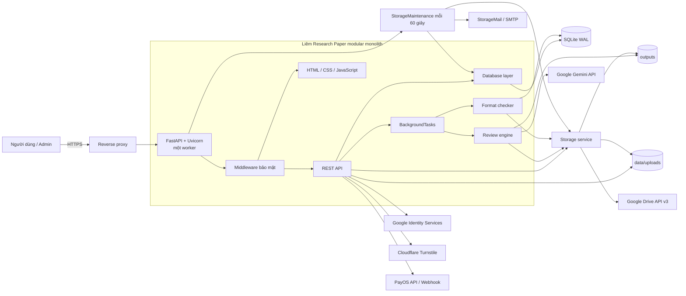
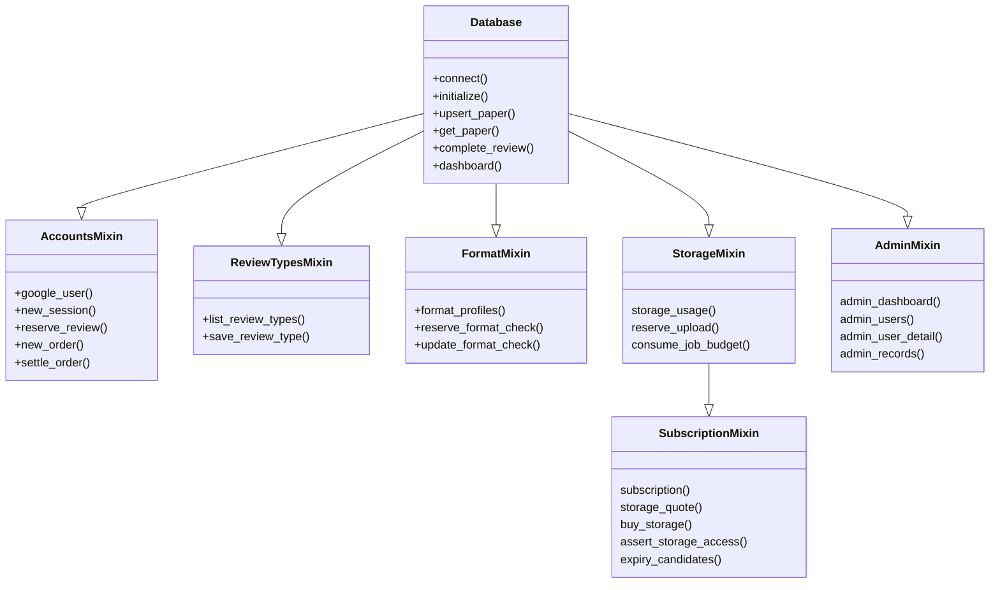
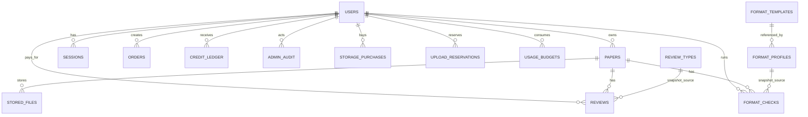
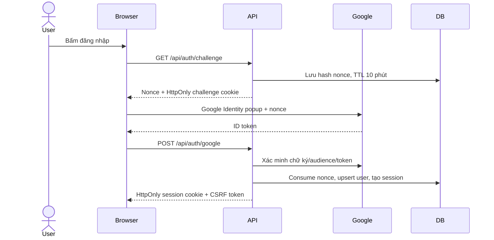
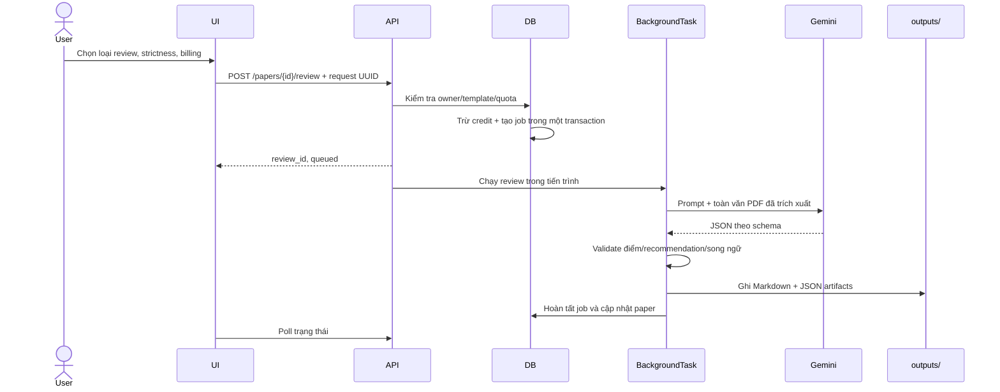
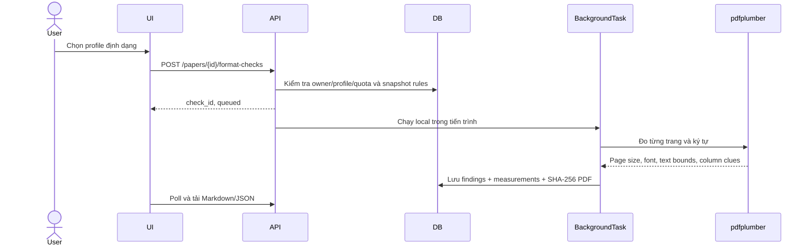
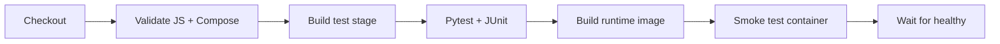

# Cấu trúc dự án, công nghệ và kiến trúc hệ thống Liêm Research Paper

## 1. Tổng quan

Liêm Research Paper là ứng dụng web hỗ trợ quản lý bản thảo khoa học theo tài khoản, review nội dung bằng AI, kiểm tra định dạng PDF theo bộ quy tắc, quản lý credit và thanh toán qua PayOS.

Hệ thống được xây dựng theo kiến trúc **modular monolith**:

- Một tiến trình FastAPI phục vụ REST API, file tĩnh và các tác vụ nền.
- Một cơ sở dữ liệu SQLite lưu tài khoản, phiên đăng nhập, bài báo, review, thanh toán, cấu hình và kết quả kiểm tra định dạng.
- PDF upload và artifact review được lưu trên filesystem.
- Review khoa học gọi Gemini; kiểm tra định dạng chạy cục bộ và không gọi AI.
- Frontend là SPA viết bằng HTML, CSS và JavaScript thuần, không có bước build frontend.

Kiến trúc này phù hợp với một máy chủ hoặc một container chạy một worker. Hệ thống hiện không có message broker, worker phân tán hoặc cơ chế chia sẻ SQLite giữa nhiều replica.

## 2. Sơ đồ kiến trúc tổng thể



Reverse proxy là thành phần triển khai khuyến nghị cho production, không nằm trong mã nguồn ứng dụng. Khi chạy local, trình duyệt có thể kết nối trực tiếp đến Uvicorn.

## 3. Cấu trúc thư mục

```text
.
├── app/
│   ├── main.py                  # Khởi tạo FastAPI, middleware, API bài báo/review
│   ├── account_routes.py        # API auth, profile, ví, PayOS và quản trị
│   ├── format_routes.py         # API profile định dạng và format check
│   ├── storage_routes.py        # Quota, mua gói, xóa cứng, cấu hình và chuyển Drive
│   ├── storage_db.py            # Quota/reservation, dashboard dung lượng, budget AI
│   ├── admin_db.py              # Báo cáo doanh thu/credit, user, tài nguyên và trigger nhật ký
│   ├── admin_routes.py          # API quản trị có phân trang, lọc ngày và phân quyền
│   ├── storage_subscription.py  # Một gói chung/user, báo giá, gia hạn, khóa nội dung
│   ├── storage_mail.py          # SMTP hệ thống, email phí gia hạn và cảnh báo xóa
│   ├── storage_maintenance.py   # Outbox retry và tự dọn bài cũ vượt mức sau 7 ngày
│   ├── storage.py               # File local/Drive, manifest, tải và xóa có retry
│   ├── db.py                    # Database facade, bài báo, review, dashboard
│   ├── accounts_db.py           # Tài khoản, session, credit, đơn hàng, audit
│   ├── review_types.py          # Loại review Markdown có phiên bản
│   ├── format_db.py             # Template, profile và kết quả định dạng
│   ├── security.py              # Auth, CSRF, CAPTCHA, mã hóa, PayOS client
│   ├── reviewer.py              # Prompt, schema, Gemini/OpenAI provider, artifact
│   ├── format_checker.py        # Đọc template và đo bố cục PDF cục bộ
│   ├── pdf_utils.py             # Trích xuất text và metadata từ PDF
│   ├── importer.py              # Nhập dữ liệu review cũ vào database
│   ├── server_lock.py           # Khóa bảo đảm một worker trên mỗi database
│   ├── config.py                # Đường dẫn, biến môi trường và giới hạn chung
│   └── static/
│       ├── index.html           # Shell của SPA
│       ├── app.js               # Dashboard, thư viện, upload, review
│       ├── accounts.js          # Login, profile, ví và trang admin
│       ├── review-types.js      # Giao diện quản lý loại review
│       ├── formats.js           # Giao diện quản lý/kiểm tra định dạng
│       ├── storage.js           # Dung lượng, dọn bài, mua gói và cấu hình admin
│       ├── admin.js             # Dashboard, hồ sơ user, giao dịch và từng menu cấu hình
│       ├── admin.css            # Sidebar quản trị, bảng/biểu đồ và responsive
│       ├── LRP.png              # Logo Liêm Research Paper
│       ├── styles.css           # Style nền ban đầu
│       └── studio.css           # Theme hiện đại và responsive
├── data/
│   ├── review_agent.db          # SQLite runtime, không commit
│   ├── .encryption-key          # Khóa local tự sinh, không commit
│   └── uploads/                 # PDF của người dùng
├── outputs/                     # Artifact review theo paper/review
├── docs/
│   ├── deployment.md            # ENV, Docker, Jenkins và vận hành
│   ├── format-checking.md       # Cấu hình và dùng format checker
│   ├── storage-and-limits.md    # Chính sách quota, Drive và rate limit
│   ├── admin-guide.md           # Hướng dẫn từng menu, định nghĩa chỉ số và quản lý user
│   └── project-architecture.md  # Tài liệu hiện tại
├── scripts/
│   ├── healthcheck.py           # Healthcheck trong container
│   ├── check_compose.py         # Kiểm tra Docker Compose bằng env mẫu
│   └── wait_container.py        # Chờ container healthy trong CI
├── tests/
│   ├── test_accounts.py         # Auth, tenant, credit, PayOS, admin, UI
│   ├── test_db.py               # Vòng đời paper/review và dashboard
│   ├── test_formats.py          # Template, format engine, quyền và UI
│   ├── test_storage.py          # Quota, mua gói, xóa, Drive, anti-spam và UI
│   ├── test_storage_subscription.py # Gia hạn gộp, khóa thư viện, email, cleanup/race
│   ├── test_importer.py         # Ghép dữ liệu review cũ
│   └── test_reviewer.py         # Schema, điểm số và báo cáo song ngữ
├── scientific_paper_review_agent_codex_prompt_v2_bilingual.md
│                                # Đặc tả review hội nghị mặc định
├── AGENTS.md                    # Quy tắc review cấp project
├── run.py                       # Điểm chạy Uvicorn
├── requirements.txt             # Dependency runtime
├── requirements-dev.txt         # Dependency kiểm thử
├── Dockerfile                   # Image test và runtime
├── docker-compose.yml           # Chạy ứng dụng và volume bền vững
├── Jenkinsfile                  # CI bằng Docker
├── .env.example                 # Mẫu biến môi trường
└── README.md                    # Hướng dẫn và mô tả sản phẩm
```

Các PDF ở thư mục gốc và artifact cũ trong `outputs/` là dữ liệu mẫu/lịch sử của workspace. Dữ liệu upload mới được đặt trong `data/uploads/`.

## 4. Công nghệ sử dụng

### 4.1 Backend

| Công nghệ | Vai trò |
| --- | --- |
| Python 3.10+ | Ngôn ngữ backend; Docker runtime dùng Python 3.12 |
| FastAPI | REST API, dependency injection, validation và OpenAPI |
| Uvicorn | ASGI server |
| Pydantic 2 | Validate request và bộ quy tắc định dạng theo strict schema |
| SQLite 3 | Kho dữ liệu giao dịch; bật WAL và foreign key |
| `python-multipart` | Nhận upload PDF, Markdown và template |
| `python-dotenv` | Đọc cấu hình từ `.env` |

### 4.2 Xử lý tài liệu và AI

| Công nghệ | Vai trò |
| --- | --- |
| `pypdf` | Trích xuất text, số trang và metadata PDF cho review |
| `pdfplumber` | Đo tọa độ ký tự, font, cỡ chữ, lề chữ và ước lượng cột |
| `defusedxml` | Đọc XML trong DOCX với giới hạn an toàn |
| `zipfile` chuẩn Python | Đọc cấu trúc Open XML của DOCX |
| Google Gen AI SDK | Gọi Gemini Interactions API và nhận JSON có schema |
| OpenAI SDK | Provider dự phòng trong mã nguồn; luồng web hiện dùng Gemini |

### 4.3 Tài khoản, bảo mật và thanh toán

| Công nghệ | Vai trò |
| --- | --- |
| Google Auth / Google Identity Services | Đăng nhập bằng Google ID token |
| `cryptography` Fernet | Mã hóa Gemini key cá nhân và secret cấu hình |
| Cloudflare Turnstile | CAPTCHA tùy chọn cho các thao tác nhạy cảm |
| PayOS Python SDK | Tạo payment link, xác minh webhook và đối soát |
| `httpx` / `requests` | Gọi Turnstile, Google Auth và các dịch vụ HTTP liên quan |

### 4.4 Frontend

| Công nghệ | Vai trò |
| --- | --- |
| HTML5 | Cấu trúc SPA, modal và drawer |
| CSS3 | Theme, grid/flex layout, responsive và reduced motion |
| JavaScript thuần | State phía client, Fetch API, DOM rendering và polling |
| Google Identity Services script | Hiển thị popup đăng nhập Google |
| Turnstile script | Hiển thị CAPTCHA khi được bật |

Frontend không sử dụng React/Vue, Node runtime, npm package hoặc bundler. Node.js chỉ được Jenkins dùng để chạy `node --check` trên JavaScript.

### 4.5 Kiểm thử và triển khai

| Công nghệ | Vai trò |
| --- | --- |
| Pytest | Unit test và integration test |
| FastAPI/Starlette TestClient | Test API với database tạm |
| Playwright + Chromium | Test tùy chọn trên desktop/mobile |
| Docker multi-stage | Tách image test và image runtime |
| Docker Compose | Cấu hình container, volume, resource limit và healthcheck |
| Jenkins Declarative Pipeline | Kiểm tra frontend/Compose, test, build và smoke test |

## 5. Phân lớp và trách nhiệm

### 5.1 Presentation layer

`app/static/` chứa toàn bộ giao diện trình duyệt. SPA giữ state trong JavaScript, gọi API bằng `fetch`, dùng `sessionStorage` để nhớ view đang mở và polling các job đang xử lý.

Các file JavaScript được chia theo miền chức năng:

- `app.js`: state chung, điều hướng, dashboard, thư viện paper, upload, khởi chạy review, hiển thị báo cáo.
- `accounts.js`: bootstrap phiên, Google Login, profile, Gemini key, ví credit, PayOS và admin.
- `review-types.js`: CRUD loại review tùy chỉnh bằng Markdown.
- `formats.js`: quản lý profile/template định dạng, khởi chạy job và hiển thị findings.

HTML và Markdown do server/AI trả về đều được escape trước khi render. Bộ chuyển Markdown ở frontend chỉ hỗ trợ một tập cú pháp giới hạn.

### 5.2 API/application layer

API được chia thành ba nhóm:

| Module | Phạm vi chính |
| --- | --- |
| `main.py` | Health, dashboard, paper, file PDF, review và middleware toàn cục |
| `account_routes.py` | Cấu hình công khai, loại review, auth, profile, wallet, PayOS và admin |
| `format_routes.py` | Profile/template định dạng, job format check và xuất báo cáo |

FastAPI dependency `current_user` và `admin` kiểm soát xác thực/phân quyền. API nghiệp vụ gọi trực tiếp database facade hoặc tạo `BackgroundTasks` cho công việc lâu hơn.

### 5.3 Domain/service layer

- `reviewer.py` tạo system instruction, ghép toàn văn bản thảo, gọi provider, validate JSON, tạo điểm số và ghi artifact.
- `format_checker.py` định nghĩa schema quy tắc, preset, bộ đọc PDF/DOCX/LaTeX/JSON và thuật toán sinh finding.
- `security.py` tập trung xác thực, phân quyền, mã hóa, CAPTCHA, rate limit và client PayOS.
- `pdf_utils.py` trích xuất profile sơ bộ và chèn marker `[[PAGE n]]` để AI có locator theo trang.

### 5.4 Persistence layer

`Database` trong `db.py` là facade kết hợp bốn mixin:



Mỗi thao tác mở một SQLite connection riêng. Các thay đổi cần tính nguyên tử dùng `BEGIN IMMEDIATE`, điển hình là trừ/hoàn credit, tạo job, thanh toán và chống trùng request.

## 6. Mô hình dữ liệu

### 6.1 Nhóm bảng

| Nhóm | Bảng | Dữ liệu chính |
| --- | --- | --- |
| Tài khoản | `users` | Google subject, profile, role, trạng thái, credit, Gemini key mã hóa |
| Phiên | `sessions`, `login_challenges` | Hash token, CSRF, nonce và thời hạn |
| Paper/review | `papers`, `reviews`, `review_types` | Metadata PDF, owner, job, điểm, báo cáo và snapshot template review |
| Định dạng | `format_templates`, `format_profiles`, `format_checks` | File template dạng BLOB, rules, revision và snapshot kết quả |
| Thanh toán | `orders`, `credit_ledger` | Đơn PayOS, số credit và sổ biến động bất biến theo reference |
| Vận hành | `settings`, `rate_limits`, `admin_audit`, `app_migrations` | Cấu hình, rate limit, nhật ký admin và migration marker |
| File lưu trữ | `stored_files`, `upload_reservations` | Vị trí/checksum file và dung lượng giữ chỗ |
| Gói dung lượng | `storage_subscriptions`, `storage_quotes`, `storage_purchases` | Một gói chung/user, báo giá có revision và lịch sử thanh toán bất biến |
| Thông báo/dọn dữ liệu | `storage_email_outbox`, `storage_cleanup_log` | Email theo kỳ và trạng thái retry, nhật ký bài đã xóa do hết hạn |
| Nhật ký user | `user_activity` | Sự kiện nghiệp vụ, tài khoản đích, admin thực hiện nếu có; không cascade khi xóa bài |
| Ngân sách tác vụ | `usage_budgets` | Bộ đếm user/phút/ngày độc lập với vòng đời bài báo |

### 6.2 Quan hệ chính



`reviews` và `format_checks` giữ snapshot cấu hình tại thời điểm nhận job. Vì vậy admin sửa hoặc tắt template không làm thay đổi báo cáo lịch sử. Quan hệ snapshot là quan hệ logic; dữ liệu cấu hình được sao chép vào record job để bảo toàn lịch sử.

Các cột JSON như điểm, rules, kết quả format và settings được serialize thành text JSON. File template PDF/DOCX/TEX/JSON được lưu dạng BLOB trong SQLite, kèm SHA-256.

## 7. Các luồng nghiệp vụ chính

### 7.1 Khởi động ứng dụng

1. `run.py` đọc `.env` rồi khởi chạy `app.main:app` bằng Uvicorn.
2. FastAPI lifespan tạo các thư mục cần thiết và lấy file lock theo đường dẫn database.
3. Database tạo bảng/index còn thiếu và chạy migration idempotent.
4. Hệ thống kiểm tra khóa Fernet; production bắt buộc `APP_ENCRYPTION_KEY` và HTTPS trong `APP_BASE_URL`.
5. Review AI dở dang được đánh dấu failed và hoàn credit đúng một lần.
6. Format check dở dang được đánh dấu failed để người dùng chạy lại.
7. Storage đăng ký PDF/artifact cũ, dọn upload dang dở có reservation và gỡ cờ chuyển đang dở; không tự chuyển bài cũ lên Drive.
8. StorageMaintenance khôi phục email đang gửi và cờ cleanup, chạy thread mỗi 60 giây nếu ENV bật. Server bắt đầu nhận request; khi tắt server chờ thread dừng trước khi nhả file lock.

### 7.2 Đăng nhập Google



Session có thời hạn bảy ngày. Token session và challenge chỉ lưu dạng SHA-256 trong database. Role admin chỉ được bootstrap từ email/sub đã cấu hình khi tài khoản đăng nhập lần đầu; sau đó được quản lý trong trang admin.

### 7.3 Upload bài báo

1. Client gửi multipart PDF, tiêu đề/tác giả tùy chọn và CAPTCHA token.
2. Middleware xác thực session, CSRF/origin và giới hạn request body.
3. Backend kiểm tra MIME, đuôi `.pdf`, chuẩn hóa filename và giữ chỗ dung lượng trong transaction trước khi ghi theo chunk vào `data/uploads/`.
4. Mặc định mỗi PDF tối đa 50 MB và mỗi tài khoản có 50 MB gồm PDF + artifact. Admin chỉnh riêng hai giới hạn; các gói 100 MB/30 ngày còn hạn cộng thêm quota.
5. `pypdf` đọc toàn bộ trang, metadata, title, author, abstract và keywords sơ bộ.
6. Record `papers` được gắn `owner_id`; API không trả `file_path` hoặc `owner_id` ra client.
7. Nếu bật Drive, file được chuyển sau khi đăng ký metadata. Chỉ xóa bản local sau xác minh checksum và lưu remote location; lỗi chuyển giữ file local để thử lại.

### 7.4 Review nội dung bằng AI



Hai chế độ billing:

- Key hệ thống: 10 credit/lần, dùng Gemini key do admin cấu hình.
- Key cá nhân: 3 credit/lần, dùng key Fernet mã hóa trong profile người dùng.

`request_id` làm idempotency key. Cùng UUID và cùng cấu hình trả lại job cũ; cùng UUID với cấu hình khác bị từ chối. Một paper chỉ có một review queued/running; mặc định mỗi tài khoản tối đa hai review đồng thời, toàn hệ thống tám, admin chỉnh được. Budget phút/ngày lưu trong `usage_budgets`; quota/concurrency/budget và trừ credit cùng transaction tạo job. Xóa bài không đặt lại budget.

Review hội nghị dùng JSON schema chặt, tám tiêu chí điểm 1–5, quyết định journal và recommendation. Review tùy chỉnh dùng Markdown theo hướng dẫn do admin cung cấp.

Nếu job lỗi, trạng thái chuyển thành failed và credit được hoàn trong cùng transaction với unique ledger reference, tránh mất hoàn phí khi xóa bài đồng thời. Hệ thống không ghi lỗi nội bộ nhạy cảm vào thông báo công khai.

### 7.5 Kiểm tra định dạng



Format checker không dùng Gemini và không trừ credit. Các phép kiểm tra gồm khổ giấy, số trang, font/cỡ chữ phổ biến, lề ký tự, ước lượng cột, tìm tên section và checklist thủ công.

Profile có sẵn gồm IEEE Conference A4, IEEE Conference US Letter và Springer LNCS. Admin có thể nhập:

- PDF: suy ra khổ trang và cỡ chữ phổ biến.
- DOCX: đọc section đầu, số cột và style Normal/default.
- TEX: đọc các khai báo trực tiếp, không biên dịch và không thực thi lệnh.
- JSON: nhập rules đúng schema.

Kết quả font, cột, lề và section là heuristic, được gắn `warning` hoặc `not_assessed` khi không đủ bằng chứng; hệ thống không tuyên bố chứng nhận tuân thủ nhà xuất bản.

### 7.6 Nạp credit qua PayOS

1. User nhập số tiền và gửi UUID request.
2. Database tạo order `creating` một lần; số credit được snapshot theo giá hiện tại.
3. API PayOS trả payment link HTTPS hợp lệ và order chuyển sang `pending`.
4. PayOS gọi webhook hoặc người dùng yêu cầu đối soát.
5. Backend xác minh chữ ký, order code, link ID, số tiền, trạng thái và VND.
6. `settle_order` cập nhật order, cộng credit và ghi ledger trong một transaction.
7. Webhook lặp không cộng tiền lần hai vì order paid và ledger reference là duy nhất.

Timeout khi tạo link được coi là trạng thái mơ hồ: order được giữ để webhook/đối soát có thể phục hồi.

## 8. API theo miền chức năng

| Nhóm | Endpoint tiêu biểu |
| --- | --- |
| Hệ thống | `GET /`, `GET /api/health`, `GET /docs` |
| Auth | `GET /api/auth/challenge`, `POST /api/auth/google`, `GET /api/auth/me`, `POST /api/auth/logout` |
| Paper | `GET/POST /api/papers`, `GET /api/papers/{id}`, `GET /api/papers/{id}/file` |
| Review | `POST /api/papers/{id}/review`, `GET /api/reviews/{id}`, `GET /api/review-types` |
| Format | `GET /api/format-profiles`, `POST/GET /api/papers/{id}/format-checks`, `GET /api/format-checks/{id}` |
| Profile | `PATCH /api/profile`, `PUT/DELETE /api/profile/gemini-key` |
| Wallet | `GET /api/wallet`, `POST /api/wallet/topup`, API order/sync |
| Storage | `GET /api/storage`, `POST /api/storage/quotes`, `POST /api/storage/purchases`, `DELETE /api/papers/{id}`, `POST /api/papers/{id}/storage/drive` |
| Email lưu trữ | `PUT /api/admin/storage/email`, `POST /api/admin/storage/email/test`; trạng thái qua `GET /api/admin/storage/settings` |
| PayOS | `POST /api/payments/payos/webhook` |
| Admin | Cấu hình, user, order, review type và format profile dưới `/api/admin/*` |

FastAPI tự sinh OpenAPI và Swagger UI ở `/docs`. Swagger không thay thế các kiểm tra session, CSRF và role của endpoint.

## 9. Artifact và lưu trữ file

### 9.1 Review hội nghị

Mỗi review tạo thư mục:

```text
outputs/<paper_slug>/review_<review_id>_<strictness>/
├── paper_analysis.json
├── novelty_review.json
├── methodology_review.json
├── experiment_review.json
├── claims.json
├── reproducibility_review.json
├── internal_scores.json
├── review_scores.json
├── final_review_bilingual.md
├── review_template.md          # Khi job có snapshot template
└── review_metadata.json        # Metadata loại review/version/billing
```

### 9.2 Review tùy chỉnh

Review Markdown tùy chỉnh tạo `final_review.md`, `paper_analysis.json`, `review_scores.json` rỗng và snapshot template/metadata.

### 9.3 Kiểm tra định dạng

Kết quả format được lưu trong `format_checks.result_json`; báo cáo Markdown/JSON được sinh khi tải về. File template gốc nằm trong `format_templates.content`, không nằm trong filesystem riêng.

### 9.4 Phân chia lưu trữ

| Dữ liệu | Vị trí mặc định | Backup cần thiết |
| --- | --- | --- |
| Trạng thái nghiệp vụ và template | `data/review_agent.db` | Có |
| Khóa mã hóa local | `data/.encryption-key` | Có, phải đi cùng database |
| PDF upload | `data/uploads/` | Có |
| Artifact review | `outputs/` | Có |
| PDF/artifact đã chuyển Drive | Drive hệ thống; ID/checksum trong `stored_files` | Có; backup database cùng kế hoạch backup Drive |
| Static source | Git/image Docker | Có thể tái tạo từ source |

### 9.5 Quota, mua gói và xóa

`StorageMixin` kế thừa `SubscriptionMixin`, tính quota từ mức miễn phí + `storage_subscriptions` còn hạn. Mỗi user chỉ có một số dư dung lượng mua thêm và một ngày gia hạn. Mua thêm giữa kỳ thu đủ phí phần mới, cộng dung lượng và giữ ngày hạn; gia hạn thu phí toàn bộ, thêm 30 ngày. Khi đã hết hạn, mua thêm phải trả cả dung lượng cũ + mới. Báo giá chụp giá/revision và hiệu lực tối đa 10 phút. Credit/ledger/gói/lịch sử cập nhật nguyên tử; UUID chống thanh toán lặp và revision chặn báo giá cũ.

`assert_storage_access` bảo vệ API nội dung: gói hết hạn + dùng vượt mức miễn phí trả `423`, khóa toàn bộ thư viện. Metadata ở trang Dung lượng vẫn dùng để gia hạn/xóa bài. Upload/review/check mới bị chặn khi vượt quota; job đã nhận vẫn hoàn tất. API đọc tính hạn trực tiếp, không phụ thuộc lịch maintenance.

`StorageMaintenance` gửi nhắc trước 3 ngày, lúc hết hạn, trước dọn và sau dọn qua `StorageMail` (SMTP chuẩn Python, STARTTLS/TLS). Outbox bền vững retry lỗi; secret SMTP mã hóa bằng Fernet, cấu hình admin ưu tiên ENV. Chỉ xóa từ mốc muộn hơn giữa hết hạn + 7 ngày và cảnh báo đầu tiên được SMTP chấp nhận + 7 ngày. Không gửi được thông báo thì giữ file. Worker xóa bài cũ nhất, kiểm tra lại quota sau mỗi bài và dừng khi đủ; không bỏ qua bài cũ đang bận/lỗi để xóa bài mới hơn. Cờ cleanup và transaction chặn gia hạn/xóa thủ công chạy xen nhau. SMTP có thể gửi trùng nếu process chết sau gửi nhưng trước khi ghi trạng thái.

`Storage` cung cấp cùng một đường truy xuất cho PDF local và Drive. Drive dùng credentials hệ thống qua `google-auth`/`AuthorizedSession`, resumable upload và SHA-256; id từ `generateIds` được lưu trước upload để retry không tạo bản sao. Metadata file ở DB còn báo cáo text/JSON vẫn trong SQLite.

Local mode giữ PDF/artifact tại server. Drive mode luôn ghi local trước; chỉ sau upload thành công và đối chiếu size/checksum mới cập nhật backend rồi xóa local. Lỗi giữ bản local. Tải từ Drive qua API có xác thực, kiểm tra checksum và dùng file tạm; không phát link công khai.

Xóa là thao tác nhiều bước: khóa bài → cờ `deletion_pending` → xóa từng file có ghi tiến độ → dọn thư mục output → xóa record/cascade. Bài đang chạy job/chuyển file không thể xóa. Nếu lỗi giữ manifest và quota cho đến lần retry thành công; ledger và budget không bị cascade. Chi tiết: [Dung lượng và giới hạn](storage-and-limits.md).

## 10. Kiến trúc bảo mật

Quản trị dùng `admin_routes.py` + `AdminMixin` để đọc báo cáo trong SQLite transaction nhất quán. Tiền thu tính từ đơn `paid` theo `paid_at`; dòng credit lấy từ ledger theo `created_at`, tách nạp/trừ/hoàn. Số dư và tài nguyên hiện tại không phụ thuộc khoảng ngày. Danh sách user, giao dịch và log phân trang ở server, trả các trường cho phép thay vì toàn bộ user/secret. Metadata tài nguyên dành cho vận hành; API nội dung PDF/review vẫn kiểm tra chủ sở hữu.

`user_activity` ghi sự kiện upload/xóa, trạng thái review/format, đơn nạp, ledger và đăng nhập qua trigger trong cùng transaction nghiệp vụ. Thay đổi quyền lưu actor/trước/sau, thu hồi phiên khi deactive và kiểm tra lại quyền actor trong transaction. Log không chứa bản thảo/token/key và tồn tại sau khi xóa bài; chỉ bắt đầu từ lúc nâng cấp, không tạo lịch sử cũ giả.

Frontend `admin.js`/`admin.css` cung cấp các trang vận hành và cấu hình độc lập trên sidebar, hồ sơ user, bộ lọc và biểu đồ tiền thu. Các PATCH cấu hình chỉ lưu nhóm đang sửa (billing/AI/auth hoặc storage/limits), tránh form ở một nhóm ghi đè nhóm khác. Mỗi trang có hướng dẫn tại chỗ; tài liệu đầy đủ ở [hướng dẫn quản trị](admin-guide.md).

### 10.1 Xác thực và phiên

- Google ID token được kiểm tra chữ ký, audience, issuer, thời hạn, `email_verified`, subject và nonce.
- Challenge nonce dùng một lần, hết hạn sau 10 phút.
- Session kéo dài bảy ngày; cookie session là HttpOnly, SameSite Lax và Secure khi `APP_BASE_URL` là HTTPS.
- Token lưu trong database ở dạng SHA-256, không lưu raw session token.
- Request ghi cần header CSRF khớp với session.

### 10.2 Phân quyền và cô lập tenant

- User chỉ truy cập paper, review và format check có `owner_id` của chính mình.
- Admin quản lý cấu hình và tài khoản nhưng không tự động đọc thư viện riêng của user khác.
- Response public loại bỏ đường dẫn filesystem, owner ID, review instruction nội bộ và billing user ID.
- User bị khóa mất toàn bộ session đang hoạt động.

### 10.3 Bảo vệ request

- Middleware kiểm tra Origin cho phương thức ghi.
- Request body có giới hạn theo endpoint, kể cả request chunked.
- PDF upload kiểm tra content type, đuôi file, basename và kích thước.
- Template tối đa 10 MB; Markdown review type tối đa 128 KB.
- DOCX có giới hạn số entry/tổng kích thước giải nén và từ chối macro.
- LaTeX chỉ được parse text; không compile, không đọc include và không chạy shell.
- Rate limit được lưu trong SQLite theo IP và theo user.
- Bộ đếm AI mặc định 6 job/phút và 50 job/ngày UTC/user, áp dụng cả key cá nhân; lỗi job vẫn tính lượt, request bị từ chối trước nhận job không trừ credit.
- Turnstile là lớp CAPTCHA tùy chọn và kiểm tra cả action/hostname.

### 10.4 Secret và dữ liệu nhạy cảm

- Gemini key cá nhân, Gemini key hệ thống, PayOS secret và Turnstile secret lưu bằng Fernet nếu ghi qua admin/profile.
- `.env`, database, khóa mã hóa và PDF upload bị loại khỏi Git/Docker build context.
- Production bắt buộc khóa Fernet do người vận hành cung cấp; mất khóa đồng nghĩa không giải mã được secret đã lưu.
- API response chỉ cho biết secret đã cấu hình hay chưa, không trả secret ra frontend.

### 10.5 Thanh toán

- Chỉ chấp nhận checkout URL thuộc `pay.payos.vn`.
- Webhook phải qua xác minh chữ ký SDK.
- Cộng credit yêu cầu order, amount và payment link khớp dữ liệu nội bộ.
- Sổ credit dùng unique reference để ngăn cộng/hoàn lặp.

### 10.6 Header bảo mật

Mọi response đặt `X-Content-Type-Options: nosniff`, `X-Frame-Options: DENY`, `Referrer-Policy: strict-origin-when-cross-origin` và `Cross-Origin-Opener-Policy: same-origin-allow-popups`. Response `/api/*` dùng `Cache-Control: no-store`.

## 11. Cấu hình hệ thống

Cấu hình có hai nguồn:

1. Biến môi trường/`.env` cung cấp bootstrap và giá trị mặc định.
2. Bảng `settings` chứa các giá trị được admin lưu; giá trị này ưu tiên hơn môi trường đối với setting có thể quản lý trên UI.

Các biến hạ tầng như `APP_BASE_URL`, `APP_ENV`, `APP_ENCRYPTION_KEY`, `REVIEW_DB_PATH`, host/port và bootstrap admin chỉ quản lý qua môi trường. Danh sách và cách cài đặt chi tiết nằm trong `docs/deployment.md`.

`app/config.py` tính đường dẫn từ thư mục project. `run.py` đọc `.env` trước khi gọi Uvicorn để host, port và reload có hiệu lực.

## 12. Đồng thời, transaction và khả năng phục hồi

### 12.1 Transaction

Các nghiệp vụ có nguy cơ race condition dùng `BEGIN IMMEDIATE`:

- tạo/chống trùng review và trừ credit;
- hoàn credit;
- tạo và settle đơn PayOS;
- tạo format check theo request UUID;
- rate limit;
- thay role/trạng thái user;
- cập nhật profile định dạng theo revision.

Update format profile dùng compare-and-swap theo `revision`, tránh hai form admin ghi đè âm thầm.

### 12.2 Job nền

Review và format check dùng FastAPI `BackgroundTasks`, chạy trong cùng tiến trình API. UI polling khoảng ba giây để cập nhật trạng thái.

Hệ quả vận hành:

- Không được chạy nhiều worker với cùng database.
- Không được chia nhiều replica cùng SQLite/filesystem.
- File lock chặn worker thứ hai trên cùng đường dẫn database.
- Khi tiến trình dừng, job đang chạy không thể tiếp tục; startup recovery chuyển job sang failed.
- AI review được hoàn credit; format check không có phí và chỉ yêu cầu chạy lại.

Nếu cần scale ngang, phải tách job sang queue/worker, chuyển database sang hệ quản trị hỗ trợ nhiều node và dùng object storage cho PDF/artifact.

## 13. Kiến trúc triển khai

### 13.1 Docker runtime

Docker image runtime:

- dùng `python:3.12-slim`;
- chạy user không đặc quyền UID/GID 10001;
- expose cổng 8000;
- có healthcheck `/api/health`;
- chạy `python run.py` với một worker.

Docker Compose bổ sung:

- filesystem gốc chỉ đọc;
- drop toàn bộ Linux capabilities và bật `no-new-privileges`;
- tmpfs cho `/tmp`;
- named volume cho `/app/data` và `/app/outputs`;
- giới hạn mặc định 2 CPU/2 GB RAM;
- log rotation;
- publish mặc định lên `127.0.0.1:8000` để đặt sau reverse proxy.

### 13.2 CI Jenkins



Pipeline không tự deploy hoặc push image. Image runtime đã kiểm thử được giữ trên Docker agent theo tag của Jenkins build để quy trình vận hành chọn triển khai.

## 14. Kiểm thử

Bộ test bao phủ:

- vòng đời paper/review và dashboard;
- xác thực, CSRF, tenant isolation và admin authorization;
- transaction credit, idempotency, concurrency và recovery;
- webhook, đối soát và thanh toán PayOS giả lập;
- schema review, recommendation và báo cáo Anh–Việt;
- nhập PDF/DOCX/TEX/JSON và các heuristic định dạng;
- upload/bounds/validation;
- giao diện desktop/mobile bằng Playwright khi được bật.

Lệnh kiểm thử chuẩn:

```bash
.venv/bin/python -m pytest -q
node --check app/static/app.js
node --check app/static/accounts.js
node --check app/static/admin.js
node --check app/static/review-types.js
node --check app/static/formats.js
python3 scripts/check_compose.py
```

Unit/integration test dùng database tạm và mock dịch vụ ngoài; không gọi Gemini tính phí, không đăng nhập Google thật và không chuyển khoản thật.

## 15. Điểm mở rộng

### Thêm loại review nội dung

Admin tạo Markdown trong `review_types`. Job mới snapshot nội dung và revision; `reviewer.py` chọn schema conference hoặc custom Markdown theo `output_format`.

### Thêm chuẩn định dạng

Admin tạo/import `format_profiles`. Muốn thêm rule tự động mới cần mở rộng:

1. `FormatRules` để validate cấu hình;
2. `analyze_format` để tạo finding;
3. form trong `formats.js`;
4. test trong `test_formats.py`;
5. tài liệu `format-checking.md`.

### Thêm AI provider

Provider cần triển khai giao diện `ReviewProvider.review(pdf_path, strictness)`, trả đúng schema và đi qua validation/artifact pipeline. Luồng web hiện khởi tạo trực tiếp `GeminiReviewProvider`, nên muốn chuyển provider theo cấu hình cần sửa cả `main.py`.

### Scale hệ thống

Lộ trình scale hợp lý:

1. PostgreSQL thay SQLite để hỗ trợ nhiều process/node.
2. Redis/RabbitMQ và worker riêng cho review/format job.
3. Object storage cho PDF, template và artifact.
4. Signed URL hoặc API streaming có quyền cho file lớn.
5. Retry/dead-letter/observability cho job và tích hợp ngoài.
6. Nhiều replica API stateless sau load balancer.

## 16. Giới hạn kiến trúc hiện tại

- Một worker trên mỗi database; không scale ngang trực tiếp.
- Job nền gắn với vòng đời tiến trình và không resume sau restart.
- SQLite, filesystem local và file Drive cần kế hoạch backup/khôi phục nhất quán; credentials hệ thống phải giữ quyền truy cập file cũ khi đổi folder/backend.
- Đường dẫn PDF/artifact được lưu dạng tuyệt đối, cần migration khi chuyển dữ liệu sang đường dẫn container/máy khác.
- PDF toàn văn được trích xuất và gửi Gemini khi chạy review nội dung.
- Format checker chỉ đọc lớp text/vector mà thư viện PDF cung cấp; chưa OCR và không chứng nhận chuẩn xuất bản.
- Frontend render phía client và không có module bundler/type checker.
- Healthcheck xác nhận API hoạt động, không xác nhận Google, Gemini, Turnstile hoặc PayOS đang dùng được.

## 17. Tài liệu liên quan

- `README.md`: tính năng và hướng dẫn sử dụng chung.
- `docs/deployment.md`: cài đặt, biến môi trường, Docker, Jenkins, production và backup.
- `docs/format-checking.md`: quản lý template và ý nghĩa từng phép kiểm tra.
- `docs/storage-and-limits.md`: quota, gói credit, xóa vĩnh viễn, Drive và giới hạn tác vụ.
- `scientific_paper_review_agent_codex_prompt_v2_bilingual.md`: đặc tả review hội nghị mặc định.
- `AGENTS.md`: quy tắc cấp project cho quy trình review khoa học.
