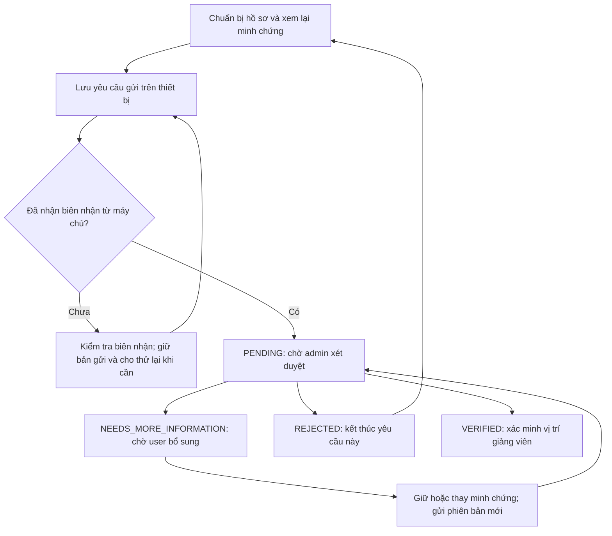

# Luồng xác minh giảng viên

## Trạng thái và thao tác

- Chỉ báo đã tiếp nhận sau khi máy chủ lưu yêu cầu và trả biên nhận. Khi gửi nền thất bại, giữ bản gửi để user thử lại.
- Khi mất kết nối sau thao tác gửi, kiểm tra theo submission key trước khi gửi lại, vì máy chủ có thể đã lưu yêu cầu. Trạng thái chưa rõ không đồng nghĩa hồ sơ chưa tồn tại.
- Chỉ admin còn hoạt động được quyết định hồ sơ PENDING; không được tự duyệt hồ sơ của mình.
- Chấp nhận yêu cầu checklist đầy đủ, tất cả nguồn bắt buộc hợp lệ và thông tin tài khoản, đơn vị, vị trí vẫn khớp với hồ sơ đã gửi.
- Yêu cầu bổ sung phải mô tả rõ cần thay đổi gì, tối thiểu 10 ký tự. Hồ sơ chuyển sang chờ user; admin không quyết định tiếp phiên bản cũ.
- Khi user bổ sung, có thể giữ tài liệu còn phù hợp, thêm hoặc thay tài liệu. Phiên bản mới liên kết hồ sơ trước, tăng revision và trở lại PENDING; các nguồn được xét lại.
- Từ chối phải có lý do, tối thiểu 10 ký tự. User vẫn dùng công cụ nghiên cứu và có thể tạo yêu cầu mới khi đã sửa thông tin hoặc có minh chứng mới.
- Quyết định và thông báo được lưu trong cùng transaction. Bấm gửi lại với cùng submission key không tạo thêm hồ sơ hoặc thông báo.
- Đổi vai trò, đơn vị hoặc vị trí làm mất hiệu lực xác minh hiện tại theo kiểm tra claim có sẵn. Kết quả trước được giữ trong lịch sử.

## Thông báo

| Mốc | User: trong app | User: email | Admin |
| --- | --- | --- | --- |
| Máy chủ tiếp nhận hồ sơ | Xác nhận và liên kết hồ sơ | Biên nhận, đơn vị/vị trí, bước tiếp theo | Thông báo hồ sơ cần duyệt trong app |
| Tiếp nhận minh chứng bổ sung | Xác nhận phiên bản cập nhật | Biên nhận bổ sung và phiên bản | Thông báo phiên bản mới cần duyệt trong app |
| Cần bổ sung | Nội dung cần bổ sung và nút bổ sung | Phản hồi công khai và liên kết đúng hồ sơ | Chờ user gửi bổ sung |
| Từ chối | Lý do và thao tác tạo yêu cầu mới | Lý do, hướng dẫn bước tiếp theo | Hồ sơ kết thúc |
| Chấp nhận | Trạng thái đã xác minh | Kết quả và hướng dẫn Hỗ trợ học thuật | Hồ sơ kết thúc |
| Chưa nhận được biên nhận từ thiết bị | Kiểm tra biên nhận, thông báo lỗi và gửi lại khi cần | Chỉ tạo biên nhận email khi máy chủ đã lưu | Chỉ có hồ sơ để duyệt khi máy chủ đã lưu |

Email chỉ gửi tới email tài khoản đã xác minh. Ghi chú nội bộ, đánh giá nội bộ và tệp minh chứng không được đưa vào email. Trong app và email đều mở đúng request ID, kể cả khi đó là hồ sơ lịch sử.

## Gửi email nền

Notification đóng vai trò outbox; worker gửi sau khi transaction đã commit. SMTP tạm thời không kết nối được hoặc trả lỗi 4xx sẽ thử lại. Lỗi SMTP 5xx được ghi FAILED; kết quả không chắc chắn sau timeout được ghi UNCERTAIN để tránh tự động gửi trùng. Lỗi email không đổi trạng thái xét duyệt và user vẫn đọc được thông báo trong app.

Trước khi gửi, worker kiểm tra trạng thái hồ sơ; mail đến trễ về hồ sơ đã có quyết định khác, đã được bổ sung hoặc đã mất hiệu lực sẽ được bỏ qua. Không hứa thời hạn xét duyệt khi chưa có chính sách thực tế.

## Kiểm chứng

`apps/backend/scripts/check-lecturer-verification-workflow.mjs` chạy trong dịch vụ backend Compose, tạo database `_test` riêng, dùng Redis database 15, storage local và tắt email thật. Chỉ database riêng do script vừa tạo được dọn sau kiểm tra.
